# pi-better-footer

[English](README.md) · [简体中文](README_zh.md)

保留 [Pi](https://pi.dev/) 原有状态栏的基本布局，在会话用量之外，融入模型额度、生成速度和 Git 修改等实用信息。



*显示内容取决于 provider、会话数据和终端宽度。*

## 功能

- **用量一目了然。** 模型信息旁显示 provider 额度和重置倒计时；会话 token、缓存命中率、花费和上下文占用仍在熟悉的位置。配色跟随主题，额度偏低或上下文占用偏高时显示警告色。
- **生成速度。** `t/s` 不含首 token 等待和工具执行耗时。`~` 表示实时估算；不含工具调用的回复结束后，改用实际 token 用量计算（扣除单独报告的推理 token）。
- **项目信息。** 在目录和分支旁补充项目的 `package.json` 版本号及新增、删除行数，包含未跟踪文件，随工作区活动更新。
- **延续模型选择。** 按目录恢复上次的模型与思考强度，轮换模型时跳过已确认额度耗尽的 provider。两项功能均可独立开关。

## 安装

```sh
pi install npm:pi-better-footer
```

也可从 GitHub 或本地仓库安装：

```sh
pi install git:github.com/roy-tian/pi-better-footer
pi install /absolute/path/to/pi-better-footer
```

在仓库目录中临时试用，无需安装：

```sh
pi --no-extensions --extension ./extensions/index.ts
```

安装后重启 Pi，在 `pi config` 中管理扩展；停用功能重叠的旧状态栏或模型轮换扩展。本地源码修改后，运行 `/reload` 或重启即可生效。

## 设置

| 操作 | 作用 |
| --- | --- |
| `/better-footer` | 分别开关模型与思考强度记忆、耗尽额度跳过。两项默认开启，设置会保存。 |
| `/scoped-models` | 配置 Pi 的模型轮换范围。额度跳过仅作用于轮换快捷键（默认 `Ctrl+P`），不影响 `/model` 手动选择。 |
| `pi --no-recent-model` | 本次运行不恢复、也不记录最近的模型与思考强度。 |

设置保存在 Pi agent 目录的 `better-footer.json`（通常为 `~/.pi/agent/`），最近模型按工作目录分别记录。显式指定的 `--model`、`--provider`、`--thinking` 和 `--models` 优先；恢复已有会话时遵循 Pi 自身的恢复逻辑。

## 额度来源

仅显示当前 provider 的额度。缺失、失败或过期的数据不会被视为额度耗尽。

| Provider | 数据来源 |
| --- | --- |
| OpenAI Codex（旧路径） | Codex app-server 额度及响应头；需要 `codex` CLI。 |
| OpenAI — 使用 ChatGPT 登录（Pi 0.99+） | 明确的应用限额错误及 ChatGPT 用量页链接，不显示数值余额。 |
| Z.AI / GLM | 使用 Pi 配置的密钥查询账户额度，429 错误作为后备来源。锤子图标表示月度工具额度（需 [Nerd Font](https://www.nerdfonts.com/)）。 |
| OpenCode Go | 使用 `OPENCODE_GO_API_KEY`、Pi 密钥或 OpenCode CLI 凭据访问用量 API；可选 dashboard cookie 后备配置。 |
| GitHub Copilot | Pi 登录记录中的 premium credits。 |
| 其他 provider | 响应头中的限流信息，可能与订阅额度不同。 |

部分来源在启用时轮询，其他来源随响应更新。扩展使用本机已有凭据。OpenCode Go 的可选配置见 [`extensions/quota/opencode-go.ts`](extensions/quota/opencode-go.ts)。

收到明确的应用限额错误后，`ChatGPT` 链接变为 `ChatGPT limit`。模型轮换最多在五分钟内据此跳过，成功响应会提前清除限制；这不是预测重置时间，也不代表整个订阅余额耗尽。虚拟模型可能路由到其他 provider，因此不参与额度轮询和额度跳过。

## 开发

需要 Node.js 24 和 Bun。Pi 相关包为运行时 peer dependencies。

```sh
bun install
bun run test
bun run lint
bun run typecheck
bun run build:check
```

## 许可证

[MIT](LICENSE)
